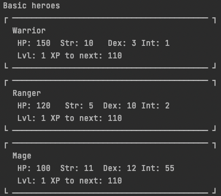

# RPG Characters#
*An exercise in use of Design patterns*

# Table of contents

- Project Goals
- Requirements and Expectations
- Screenshots

---
### Project Goals ### 

**The goal of this project is to choose a suitable design patters for the given task of creating an
RPG character system** .
=======
**The goal of this project is to choose a suitable design patters for the given task of creating an RPG character system** .

---
### Requirements and Expectations ### 

**Requirements**

- Generate some characters
    - give them XP so their attributes increase at higher levels.
- Create items of various kinds
    - Melee weapons, Ranged weapons, Magic weapons
    - Clot Armor, Leather Armor, Plate Armor
- Equip items to characters
    - Show that characters stats changes depending on armor item
- Show attacking damage of a character
    - only amount of damage

**Screenshots**

*Heroes leveled up*

